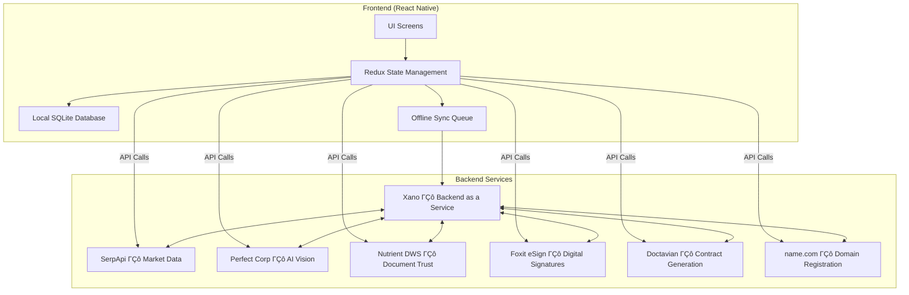
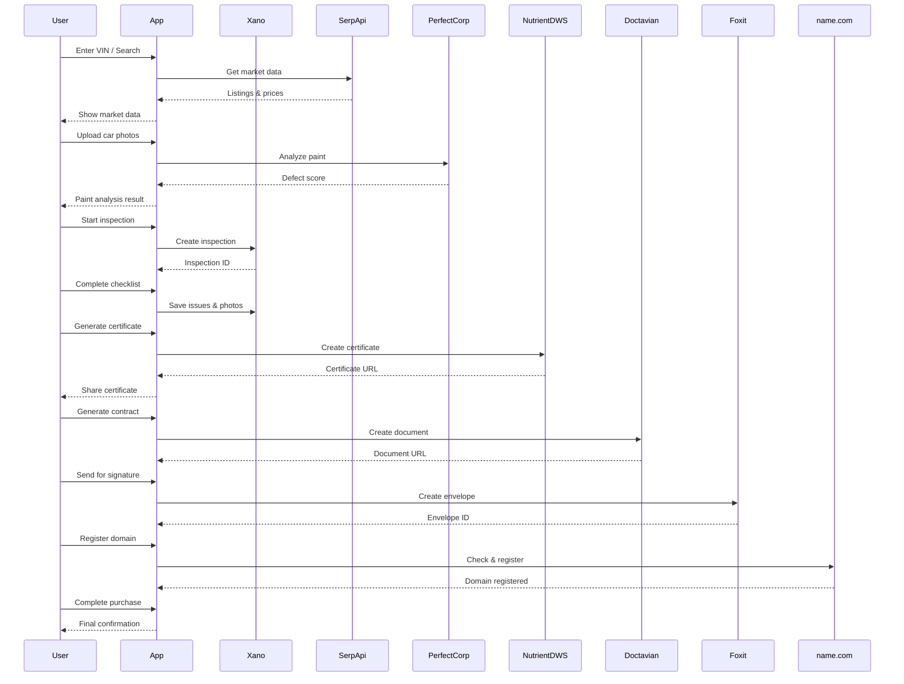
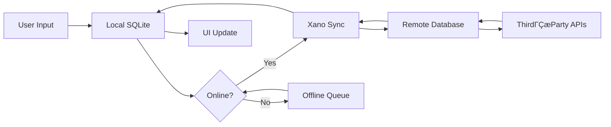

# CarWise ΓÇô AIΓÇæPowered Used Car Inspection Platform

> **From VIN search to signed contract in minutes with realΓÇætime price intelligence, AI paint inspection, smart contract generation, humanΓÇæinΓÇætheΓÇæloop eΓÇæsignatures, and verified certificates.**

CarWise is a comprehensive mobile application that revolutionises the usedΓÇæcar buying experience. It combines realΓÇætime market data, AIΓÇædriven vehicle inspection, document generation, eΓÇæsignature, and domain registration into a single, seamless workflow. Built for the DevNetwork [API + Cloud + AI] Hackathon 2026, CarWise integrates seven sponsor APIs to deliver a complete, productionΓÇæready solution.

---

## 📖 Table of Contents

1. [Overview](#overview)
2. [Key Features](#key-features)
3. [Architecture](#architecture)
4. [Tech Stack](#tech-stack)
5. [Sponsor Integrations](#sponsor-integrations)
6. [System Flow](#system-flow)
7. [Data Flow](#data-flow)
8. [Getting Started](#getting-started)
9. [Project Structure](#project-structure)
10. [API Reference](#api-reference)
11. [Testing](#testing)
12. [Deployment](#deployment)
13. [Contributing](#contributing)
14. [License](#license)

---

## Overview

CarWise is the worldΓÇÖs first endΓÇætoΓÇæend AIΓÇæpowered usedΓÇæcar inspection and purchase platform. It guides users through the entire carΓÇæbuying journey, from initial search to final signature:

1. **Search & Market Data** ΓÇô RealΓÇætime car listings and price comparisons via SerpApi.
2. **AI Paint Analysis** ΓÇô Upload car photos and get a condition score using Perfect CorpΓÇÖs AI.
3. **Vehicle Inspection** ΓÇô StepΓÇæbyΓÇæstep checklist with issue detection and severity scoring.
4. **Trusted Certificates** ΓÇô Generate tamperΓÇæproof inspection certificates via Nutrient DWS.
5. **Contract Generation** ΓÇô Create legally binding purchase agreements with DoctavianΓÇÖs smart templates.
6. **eΓÇæSignature** ΓÇô Send documents for digital signature using Foxit eSign.
7. **Domain Registration** ΓÇô Automatically register a domain for the vehicle with name.com.

All data is synchronised across devices via Xano, a backendΓÇæasΓÇæaΓÇæservice, with full offline support and conflict resolution.

---

## Key Features

### 🔍 Real‑Time Market Data (SerpApi)
- Search for any vehicle by make, model, year, or VIN.
- View current market prices, historical trends, and dealer ratings.
- Price alerts and notifications for price drops.

### 🖼️ AI Paint Analysis (Perfect Corp)
- Upload car photos for AIΓÇæbased defect detection (scratches, rust, dents).
- Get an overall paint condition score and detailed metrics.
- Compare results across multiple photos.

### 📋 Smart Inspection (Xano)
- Guided checklist covering exterior, interior, engine, and test drive.
- Add photos, voice notes, and severity tags to each issue.
- RealΓÇætime sync with Xano backend; works offline with automatic sync.

### 🛡️ Trusted Certificates (Nutrient DWS)
- Generate a verifiable, tamperΓÇæproof certificate for any inspection.
- Includes audit trail, confidence scores, and humanΓÇæreview flags.
- Share certificates via QR code or link.

### 📄 Contract Generation (Doctavian)
- Generate purchase agreements, service contracts, and warranty documents.
- Smart templates with conditional logic and dynamic data.
- OneΓÇæclick export to PDF.

### ✍️ e‑Signature (Foxit eSign)
- Send contracts to buyers and sellers for digital signature.
- Track signing progress in real time.
- Webhook integration for completion notifications.

### 🌐 Domain Registration (name.com)
- Automatically check and register domains based on vehicle VIN.
- Set up DNS records to point to the carΓÇÖs inspection page.
- AutoΓÇærenewal and management dashboard.

---

## Architecture

The app follows a modern, modular architecture with clear separation of concerns. Below is the highΓÇælevel architecture diagram:



### Component Breakdown

| Component | Description |
|-----------|-------------|
| **UI Screens** | React Native components with animations, gestures, and responsive layout. |
| **Redux State** | Centralised state management with slices for auth, inspection, market, documents, and billing. |
| **Local Database** | SQLite for offline storage of inspections, vehicles, and user data. |
| **Offline Sync** | Queue of actions that are automatically synced when the device comes online. |
| **Xano** | MultiΓÇætenant backend with REST APIs, WebSocket for realΓÇætime updates, and static hosting. |
| **Sponsor Services** | Dedicated clients for each sponsor API with circuit breakers, retries, and caching. |

---

## Tech Stack

| Category | Technology |
|----------|------------|
| **Frontend Framework** | React Native (Expo) |
| **State Management** | Redux Toolkit + Redux Persist |
| **Local Storage** | expo-sqlite (SQLite) |
| **Navigation** | React Navigation v6 (Stack, Bottom Tabs) |
| **UI Components** | Custom components with react-native-paper, react-native-vector-icons |
| **Animations** | react-native-reanimated, Animated API |
| **Networking** | Axios with interceptors, circuit breakers, retries |
| **RealΓÇætime** | Socket.io client for WebSocket updates |
| **Backend** | Xano (lowΓÇæcode backend) |
| **APIs** | SerpApi (market data), Perfect Corp (vision), Nutrient DWS (documents), Foxit eSign, Doctavian, name.com |
| **Push Notifications** | Expo Notifications |
| **Analytics** | Custom event tracking with Amplitude (optional) |
| **Error Tracking** | Sentry (optional) |
| **Testing** | Jest + React Native Testing Library |
| **CI/CD** | GitHub Actions (planned) |

---

## Sponsor Integrations

CarWise leverages seven sponsor APIs to deliver a complete carΓÇæbuying experience. Each integration is implemented as a standalone service with robust error handling, caching, and offline support.

### 1. SerpApi ΓÇô RealΓÇæTime Market Data

**Purpose:** Provide live car listings, pricing, and dealer information.

**Integration Points:**
- `search()` ΓÇô Query Google Shopping for vehicle listings.
- `streamPrices()` ΓÇô WebSocket for realΓÇætime price updates.
- `getPriceHistory()` ΓÇô Historical price trends for a specific VIN.

**Code Example:**
```javascript
const results = await serpApi.search({ make: 'Toyota', model: 'Camry', year: 2023 });
console.log(`Found ${results.total} listings, avg price $${results.avgPrice}`);
```

**Error Handling:** Circuit breaker with 3 retries, exponential backoff, and staleΓÇæwhileΓÇærevalidate caching.

---

### 2. Perfect Corp ΓÇô AI Paint Analysis

**Purpose:** Analyze car photos to detect scratches, rust, and paint condition.

**Integration Points:**
- `analyzeCarPaint(imageBase64)` ΓÇô Single image analysis.
- `batchAnalyze(imageArray)` ΓÇô Process up to 5 images concurrently.
- `classifyDefects(imageBase64)` ΓÇô Return defect types with confidence scores.

**Code Example:**
```javascript
const result = await perfectCorp.analyzeCarPaint(base64Image);
console.log(`Paint score: ${result.overallScore}/100`);
```

**Error Handling:** Fallback to individual analysis if batch fails; rate limiting (5 images per batch).

---

### 3. Xano ΓÇô Backend as a Service

**Purpose:** Centralised data storage, user management, and offline sync.

**Integration Points:**
- `sync()` ΓÇô Pull remote changes and push local updates.
- `queueOfflineAction()` ΓÇô Store actions when offline.
- `processOfflineQueue()` ΓÇô Execute pending actions when online.

**Code Example:**
```javascript
const xano = new XanoService('tenant-123');
await xano.sync(); // Syncs inspections, vehicles, and user data
```

**Error Handling:** Conflict resolution (remote wins), action deduplication, and automatic retry.

---

### 4. Nutrient DWS ΓÇô Document Trust

**Purpose:** Extract data from documents and generate tamperΓÇæproof certificates.

**Integration Points:**
- `extractDocument(imageUrl, schema)` ΓÇô Extract VIN, mileage, etc. with confidence scores.
- `generateCertificate(inspectionData)` ΓÇô Create a verifiable certificate with audit trail.

**Code Example:**
```javascript
const extracted = await nutrient.extractDocument(photoUri, vinSchema);
const cert = await nutrient.generateCertificate(inspection);
```

**Error Handling:** LowΓÇæconfidence fields flagged for human review; certificate hashed and timestamped.

---

### 5. Foxit eSign ΓÇô Digital Signatures

**Purpose:** Send documents for legally binding digital signatures.

**Integration Points:**
- `createAndSendEnvelope(doc, recipients, subject)` ΓÇô Create and send signature request.
- `getStatus(envelopeId)` ΓÇô Poll for signing completion.

**Code Example:**
```javascript
const envelope = await foxit.createAndSendEnvelope(
  { name: 'Agreement.pdf', content: base64Pdf },
  [{ email: 'buyer@example.com' }],
  'Purchase Agreement'
);
```

**Error Handling:** Webhook simulation via polling; cancellation support.

---

### 6. Doctavian ΓÇô Contract Generation

**Purpose:** Generate dynamic, legally compliant documents using smart templates.

**Integration Points:**
- `generateDocument(templateId, data)` ΓÇô Render document with data.
- `batchGenerate(templateId, dataArray)` ΓÇô Generate multiple documents.

**Code Example:**
```javascript
const contract = await doctavian.generateDocument('purchase_agreement', {
  buyer: 'John Doe',
  seller: 'Jane Smith',
  price: 25000,
  vin: '1HGCM82633A123456',
});
```

**Error Handling:** Template caching; automatic retry on failure.

---

### 7. name.com ΓÇô Domain Registration

**Purpose:** Register domains and manage DNS records for vehicleΓÇæspecific landing pages.

**Integration Points:**
- `checkAvailability(domains)` ΓÇô Bulk availability check.
- `registerDomain(domain, contactInfo)` ΓÇô Register domain.
- `setDNSRecord(domain, record)` ΓÇô Configure DNS.

**Code Example:**
```javascript
const available = await nameCom.checkAvailability(['toyotacamry2023.com']);
if (available[0].available) {
  await nameCom.registerDomain('toyotacamry2023.com', contact);
}
```

**Error Handling:** AutoΓÇærenewal service (daily check); fallback to alternative domains.

---

## System Flow

The endΓÇætoΓÇæend user journey is orchestrated through a series of screens and service calls. The sequence diagram below illustrates the main flow:



---

## Data Flow

Data flows through the app in a structured manner, with clear boundaries between local, remote, and thirdΓÇæparty services. The following diagram illustrates the data path for an inspection:



### Data Persistence Strategy

1. **Local SQLite** ΓÇô All userΓÇægenerated data (inspections, issues, photos) is stored locally immediately.
2. **Offline Queue** ΓÇô Actions are queued when offline and replayed in order when connectivity returns.
3. **Xano Remote** ΓÇô Single source of truth for all user data across devices.
4. **Sponsor APIs** ΓÇô Data is fetched onΓÇædemand and cached with a TTL.

### Conflict Resolution

- **Remote Wins** ΓÇô When conflicts occur (e.g., two users modify the same inspection), the remote version takes precedence.
- **Manual Merge** ΓÇô Users can review and accept/reject changes for critical fields (e.g., price).
- **Audit Trail** ΓÇô All changes are logged for accountability.

---

## Getting Started

### Prerequisites

- Node.js 16+ and npm/yarn
- Expo CLI (`npm install -g expo-cli`)
- iOS Simulator / Android Emulator or physical device
- API keys for all sponsor services (see Environment Variables)

### Installation

```bash
git clone https://github.com/yourusername/carwise.git
cd carwise
npm install
```

### Environment Variables

Create a `.env` file in the root directory with the following variables:

```env
# SerpApi
SERPAPI_KEY=your_serpapi_key
SERPAPI_WEBSOCKET_URL=wss://stream.serpapi.com

# Perfect Corp
PERFECT_CORP_API_KEY=your_perfect_corp_key

# Xano
XANO_API_KEY=your_xano_key
XANO_BASE_URL=https://your-workspace.xano.com
XANO_WEBSOCKET_URL=wss://your-workspace.xano.com/ws

# Nutrient DWS
NUTRIENT_DWS_API_KEY=your_nutrient_key

# Foxit eSign
FOXIT_ESIGN_API_KEY=your_foxit_key
FOXIT_ESIGN_BASE_URL=https://na1.foxitesign.foxit.com/api

# Doctavian
DOCTAVIAN_API_KEY=your_doctavian_key

# name.com
NAME_COM_USERNAME=your_username
NAME_COM_TOKEN=your_token
NAME_COM_BASE_URL=https://api.dev.name.com/core/v1
```

### Running the App

```bash
# Start Expo development server
expo start

# Run on iOS
expo start --ios

# Run on Android
expo start --android

# Run on Web
expo start --web
```

### Building for Production

```bash
# iOS
expo build:ios

# Android
expo build:android
```

---

## Project Structure

```
carwise/
Γö£ΓöÇΓöÇ .env                    # Environment variables
Γö£ΓöÇΓöÇ .gitignore
Γö£ΓöÇΓöÇ app.json
Γö£ΓöÇΓöÇ package.json
Γö£ΓöÇΓöÇ babel.config.js
Γö£ΓöÇΓöÇ App.js                  # Root component
Γö£ΓöÇΓöÇ src/
Γöé   Γö£ΓöÇΓöÇ api/                # API clients for sponsors and Xano
Γöé   Γöé   Γö£ΓöÇΓöÇ client.js       # Unified client with circuit breaker
Γöé   Γöé   Γö£ΓöÇΓöÇ serpApi.js
Γöé   Γöé   Γö£ΓöÇΓöÇ perfectCorp.js
Γöé   Γöé   Γö£ΓöÇΓöÇ xanoClient.js
Γöé   Γöé   Γö£ΓöÇΓöÇ nutrientDWS.js
Γöé   Γöé   Γö£ΓöÇΓöÇ foxitESign.js
Γöé   Γöé   Γö£ΓöÇΓöÇ doctavian.js
Γöé   Γöé   ΓööΓöÇΓöÇ nameCom.js
Γöé   Γö£ΓöÇΓöÇ components/         # Reusable UI components
Γöé   Γöé   Γö£ΓöÇΓöÇ ui/             # Buttons, inputs, cards, modals
Γöé   Γöé   Γö£ΓöÇΓöÇ animations/     # Fade, slide, scale wrappers
Γöé   Γöé   Γö£ΓöÇΓöÇ feedback/       # Toasts, skeletons, empty states
Γöé   Γöé   ΓööΓöÇΓöÇ ...             # Sponsor-specific cards
Γöé   Γö£ΓöÇΓöÇ context/            # React Context providers
Γöé   Γöé   Γö£ΓöÇΓöÇ ThemeContext.js
Γöé   Γöé   Γö£ΓöÇΓöÇ SponsorContext.js
Γöé   Γöé   Γö£ΓöÇΓöÇ InspectionContext.js
Γöé   Γöé   ΓööΓöÇΓöÇ AuthContext.js
Γöé   Γö£ΓöÇΓöÇ db/                 # SQLite database setup and queries
Γöé   Γöé   Γö£ΓöÇΓöÇ index.js
Γöé   Γöé   Γö£ΓöÇΓöÇ migrations.js
Γöé   Γöé   ΓööΓöÇΓöÇ models/
Γöé   Γö£ΓöÇΓöÇ hooks/              # Custom React hooks
Γöé   Γöé   Γö£ΓöÇΓöÇ useAuth.js
Γöé   Γöé   Γö£ΓöÇΓöÇ useBilling.js
Γöé   Γöé   Γö£ΓöÇΓöÇ useSearch.js
Γöé   Γöé   Γö£ΓöÇΓöÇ useXanoStatus.js
Γöé   Γöé   ΓööΓöÇΓöÇ ...
Γöé   Γö£ΓöÇΓöÇ navigation/         # React Navigation setup
Γöé   Γöé   Γö£ΓöÇΓöÇ AppNavigator.js
Γöé   Γöé   ΓööΓöÇΓöÇ SponsorNavigator.js
Γöé   Γö£ΓöÇΓöÇ screens/            # All screens
Γöé   Γöé   Γö£ΓöÇΓöÇ auth/           # Login, Register, Forgot
Γöé   Γöé   Γö£ΓöÇΓöÇ inspection/     # Checklist, Issues, Summary
Γöé   Γöé   Γö£ΓöÇΓöÇ sponsor/        # Each sponsor's dedicated screen
Γöé   Γöé   ΓööΓöÇΓöÇ ...
Γöé   Γö£ΓöÇΓöÇ services/           # Business logic services
Γöé   Γöé   Γö£ΓöÇΓöÇ BillingService.js
Γöé   Γöé   Γö£ΓöÇΓöÇ SearchService.js
Γöé   Γöé   Γö£ΓöÇΓöÇ DocumentService.js
Γöé   Γöé   Γö£ΓöÇΓöÇ CollaborationService.js
Γöé   Γöé   ΓööΓöÇΓöÇ ...
Γöé   Γö£ΓöÇΓöÇ store/              # Redux Toolkit store
Γöé   Γöé   Γö£ΓöÇΓöÇ index.js
Γöé   Γöé   Γö£ΓöÇΓöÇ rootReducer.js
Γöé   Γöé   ΓööΓöÇΓöÇ slices/         # Auth, inspection, market, etc.
Γöé   Γö£ΓöÇΓöÇ styles/             # Global styles, theme, spacing
Γöé   Γöé   Γö£ΓöÇΓöÇ theme.js
Γöé   Γöé   Γö£ΓöÇΓöÇ colors.js
Γöé   Γöé   ΓööΓöÇΓöÇ globalStyles.js
Γöé   ΓööΓöÇΓöÇ utils/              # Utilities
Γöé       Γö£ΓöÇΓöÇ cache.js
Γöé       Γö£ΓöÇΓöÇ retry.js
Γöé       Γö£ΓöÇΓöÇ logger.js
Γöé       Γö£ΓöÇΓöÇ animations.js
Γöé       ΓööΓöÇΓöÇ validators.js
ΓööΓöÇΓöÇ __tests__/              # Unit and integration tests
    Γö£ΓöÇΓöÇ services/
    ΓööΓöÇΓöÇ components/
```

---

## API Reference

### SerpApi

| Endpoint | Method | Description |
|----------|--------|-------------|
| `/search.json` | GET | Search vehicle listings. Parameters: `q`, `engine=google_shopping`, `num`, `start` |
| WebSocket | stream | RealΓÇætime price updates for a VIN |

### Perfect Corp

| Endpoint | Method | Description |
|----------|--------|-------------|
| `/skin/analyze` | POST | Analyze a single image. Body: `{ image: base64 }` |
| `/batch/analyze` | POST | Batch analyze up to 5 images. Body: `{ images: [base64] }` |

### Xano

| Endpoint | Method | Description |
|----------|--------|-------------|
| `/tenants/:tenantId/vehicles` | GET | List vehicles for a tenant |
| `/tenants/:tenantId/vehicles` | POST | Create a new vehicle |
| `/tenants/:tenantId/vehicles/:id` | PUT | Update vehicle |
| `/tenants/:tenantId/inspections` | GET/POST | List or create inspections |
| `/tenants/:tenantId/users/:userId/usage` | GET | Get usage statistics |

### Nutrient DWS

| Endpoint | Method | Description |
|----------|--------|-------------|
| `/extraction/extract` | POST | Extract data from document with schema |
| `/certificates` | POST | Generate a trusted certificate |

### Foxit eSign

| Endpoint | Method | Description |
|----------|--------|-------------|
| `/envelopes` | POST | Create an envelope with documents and recipients |
| `/envelopes/:id/send` | PUT | Send the envelope for signature |
| `/envelopes/:id` | GET | Get envelope status |

### Doctavian

| Endpoint | Method | Description |
|----------|--------|-------------|
| `/generate` | POST | Generate document from template |
| `/templates` | GET | List available templates |

### name.com

| Endpoint | Method | Description |
|----------|--------|-------------|
| `/domains/:domain/availability` | GET | Check domain availability |
| `/domains` | POST | Register a domain |
| `/domains/:domain/records` | POST | Add DNS record |

---

## Testing

We use Jest and React Native Testing Library for unit and integration tests.

### Running Tests

```bash
npm test
```

### Test Coverage

```bash
npm test -- --coverage
```

### Example Test (Billing Service)

```javascript
import { BillingService } from '../src/services/BillingService';

describe('BillingService', () => {
  it('should track usage correctly', async () => {
    const service = new BillingService('tenant1', 'user1');
    await service.trackUsage('serpSearch', 2);
    const usage = await service.getUsage();
    expect(usage.monthly['2024-09']['serpSearch']).toBe(2);
  });
});
```

---

## Deployment

### Deploying to App Stores

1. **iOS:** Follow Apple's App Store submission guidelines. Use Expo's build service or Xcode.
2. **Android:** Generate a signed APK/AAB and upload to Google Play Console.

### Deploying Backend (Xano)

Xano instances are deployed automatically from the Xano dashboard. Use the CLI to push changes.

```bash
xano push --environment production
```

### Deploying Static Assets

Static assets (HTML, images) can be hosted on Xano's static hosting:

```bash
xano deploy static --path ./dist
```

---

## Contributing

We welcome contributions! Please follow these steps:

1. Fork the repository.
2. Create a feature branch: `git checkout -b feature/my-feature`.
3. Commit your changes: `git commit -m 'Add some feature'`.
4. Push to the branch: `git push origin feature/my-feature`.
5. Open a pull request.

Please ensure your code passes all tests and adheres to the project's coding style.

---

## License

This project is licensed under the MIT License. See the [LICENSE](LICENSE) file for details.

---

## Acknowledgments

- **DevNetwork** for hosting the hackathon.
- **All sponsors** for providing APIs and prizes.
- The openΓÇæsource community for the libraries that made this project possible.

## Frontend Demo Layers

- `src/redesign` is the default presentation layer.
- `src/redesign-v3` is available through `v3-preview`.
- `src/redesign-v4` is available through `design-system-v4`.
- `src/carwise-ai-v5` and `AIShowcaseV5` are available through `ai-lab-v5`.

V4 and V5 fixtures are for visual QA only. Mock findings, prices, media URLs, and async services must not replace production inspection state or ship as customer-facing results. See [README_V5_AI_MOCK.md](README_V5_AI_MOCK.md).

---

**CarWise – Built with ❤️ for the DevNetwork [API + Cloud + AI] Hackathon 2026.**
