# CarWise

## AI-Powered Used-Car Inspection, Evidence, Market Intelligence, and Purchase Workflow

> **CarWise** is a React Native / Expo mobile application for turning a used-car inspection into a structured, persistent, evidence-linked workflow. The application combines vehicle identification, guided inspection, photo evidence, AI-assisted analysis, issue tracking, market comparison, local persistence, recovery, inspection history, reporting, and an extensible integration architecture.

---

## Table of Contents

* [1. Project Overview](#1-project-overview)
* [2. Core Problem](#2-core-problem)
* [3. Product Architecture](#3-product-architecture)
* [4. Current Repository Baseline](#4-current-repository-baseline)
* [5. Technology Stack](#5-technology-stack)
* [6. Runtime Architecture](#6-runtime-architecture)
* [7. Application Composition](#7-application-composition)
* [8. Domain Model](#8-domain-model)
* [9. Inspection Workflow](#9-inspection-workflow)
* [10. Vehicle Identity and VIN](#10-vehicle-identity-and-vin)
* [11. Evidence and Media Architecture](#11-evidence-and-media-architecture)
* [12. AI Analysis Architecture](#12-ai-analysis-architecture)
* [13. Market Comparison Engine](#13-market-comparison-engine)
* [14. Issue and Repair Modeling](#14-issue-and-repair-modeling)
* [15. Local Persistence](#15-local-persistence)
* [16. Retry Queue and Recovery](#16-retry-queue-and-recovery)
* [17. Backup and Restore](#17-backup-and-restore)
* [18. Inspection History and Comparison](#18-inspection-history-and-comparison)
* [19. Reporting and PDF Generation](#19-reporting-and-pdf-generation)
* [20. Navigation and Redesign Architecture](#20-navigation-and-redesign-architecture)
* [21. API and Provider Architecture](#21-api-and-provider-architecture)
* [22. Security and Privacy](#22-security-and-privacy)
* [23. Accessibility and UX Engineering](#23-accessibility-and-ux-engineering)
* [24. Performance Engineering](#24-performance-engineering)
* [25. Testing Strategy](#25-testing-strategy)
* [26. Error Handling and Resilience](#26-error-handling-and-resilience)
* [27. Build and Release Engineering](#27-build-and-release-engineering)
* [28. Environment Configuration](#28-environment-configuration)
* [29. Repository Structure](#29-repository-structure)
* [30. Architecture Decision Records](#30-architecture-decision-records)
* [31. Production Hardening Roadmap](#31-production-hardening-roadmap)
* [32. Engineering Contribution Guide](#32-engineering-contribution-guide)
* [33. Troubleshooting](#33-troubleshooting)
* [34. Technical Glossary](#34-technical-glossary)
* [35. Final Architecture Summary](#35-final-architecture-summary)

---

# 1. Project Overview

CarWise is designed around a field workflow rather than a conventional automotive marketplace.

The primary job of the application is to help a user collect information about a specific used vehicle, preserve the evidence, organize findings, compare market context, and produce a reusable inspection record.

The application can be understood as a pipeline:

```text
Vehicle
   ↓
Inspection
   ↓
Evidence
   ↓
Analysis
   ↓
Findings
   ↓
Cost / Market Context
   ↓
Human Review
   ↓
Inspection Summary
   ↓
Report / Share
```

The important architectural characteristic is that every stage produces structured state that can be reused by later stages.

For example:

```text
VIN
 ↓
vehicle identity
 ↓
inspection record
 ↓
photo evidence
 ↓
AI finding
 ↓
repair estimate
 ↓
summary
 ↓
report
```

This allows CarWise to evolve from a prototype into a larger vehicle-intelligence platform without forcing every screen to talk directly to external APIs.

---

## 1.1 Product Goals

The application is designed around six engineering goals.

### Evidence capture

Turn an informal walk-around into structured inspection evidence.

### Contextual interpretation

Combine user observations with AI-assisted analysis.

### Market awareness

Provide a structured representation of market comparison data.

### Resilience

Preserve the inspection locally even when external services, connectivity, or application operations fail.

### Traceability

Maintain relationships between evidence, findings, calculations, and generated reports.

### Extensibility

Allow additional AI, market, document, or backend providers to be introduced without rewriting the entire UI.

---

## 1.2 Non-Goals

CarWise should not be represented as:

* a replacement for a certified mechanical inspection;
* an authoritative legal determination of vehicle condition;
* a guarantee that an AI observation is correct;
* a replacement for official vehicle records;
* a financial or purchasing authority that makes decisions for the user.

The software provides evidence and decision-support context.

The final judgment belongs to the user and, where appropriate, qualified professionals.

---

# 2. Core Problem

Used-car inspection involves several information sources that are normally disconnected.

A buyer may have:

```text
listing information
VIN
mileage
photos
inspection observations
mechanical notes
market prices
repair estimates
seller information
documents
```

The information is frequently fragmented across:

```text
web browser
notes app
camera roll
spreadsheets
messages
vehicle-history websites
mechanic conversations
paper documents
```

CarWise attempts to unify those artifacts into one inspection state.

---

## 2.1 Information fragmentation

Without a structured workflow:

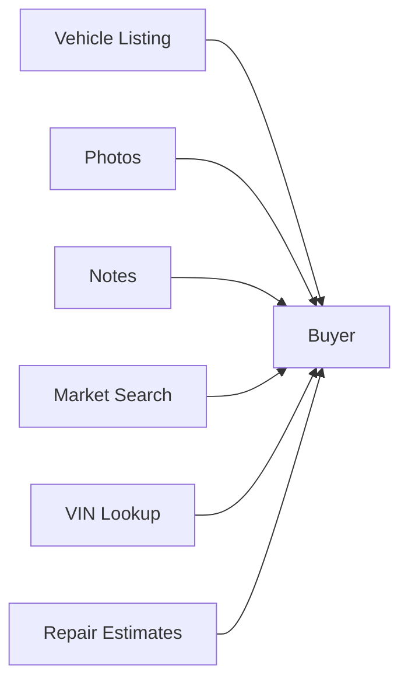
```mermaid
flowchart LR
    A[Vehicle Listing] --> B[Buyer]
    C[Photos] --> B
    D[Notes] --> B
    E[Market Search] --> B
    F[VIN Lookup] --> B
    G[Repair Estimates] --> B
```

The user becomes the integration layer.

With CarWise:

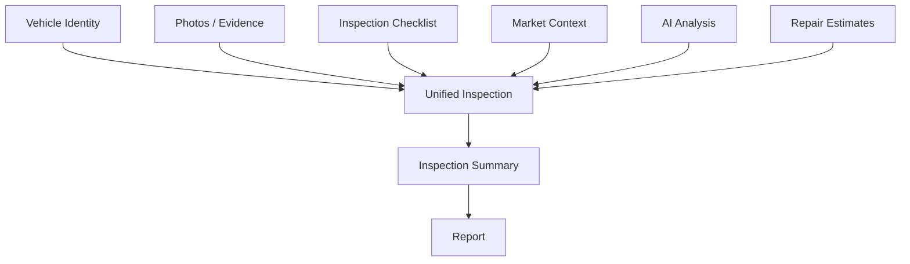
```mermaid
flowchart TB
    Vehicle[Vehicle Identity]
    Evidence[Photos / Evidence]
    Checklist[Inspection Checklist]
    Market[Market Context]
    AI[AI Analysis]
    Repairs[Repair Estimates]

    Vehicle --> Inspection[Unified Inspection]
    Evidence --> Inspection
    Checklist --> Inspection
    Market --> Inspection
    AI --> Inspection
    Repairs --> Inspection

    Inspection --> Summary[Inspection Summary]
    Summary --> Report[Report]
```

The application becomes the integration layer.

---

# 3. Product Architecture

CarWise is best understood as a local-first mobile application with optional remote service integrations.

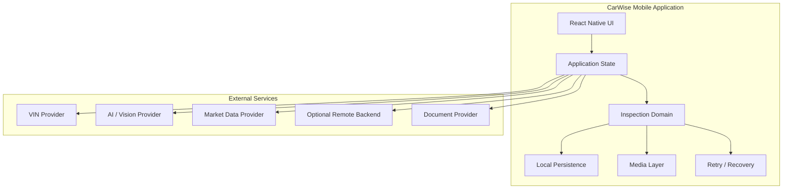
```mermaid
flowchart TB
    subgraph Mobile["CarWise Mobile Application"]
        UI["React Native UI"]
        State["Application State"]
        Domain["Inspection Domain"]
        Persistence["Local Persistence"]
        Media["Media Layer"]
        Recovery["Retry / Recovery"]
    end

    subgraph Services["External Services"]
        VIN["VIN Provider"]
        Vision["AI / Vision Provider"]
        Market["Market Data Provider"]
        Backend["Optional Remote Backend"]
        Documents["Document Provider"]
    end

    UI --> State
    State --> Domain
    Domain --> Persistence
    Domain --> Media
    Domain --> Recovery

    State --> VIN
    State --> Vision
    State --> Market
    State --> Backend
    State --> Documents
```

The architecture intentionally separates:

```text
presentation
application state
domain logic
infrastructure
external providers
```

---

## 3.1 Architectural Principle

A key principle is:

> External services should enhance the inspection, not become the inspection.

The user should still have a durable inspection record if:

```text
network = unavailable
AI provider = unavailable
market provider = unavailable
remote backend = unavailable
```

That requires local persistence and explicit failure states.

---

## 3.2 Primary Data Flow

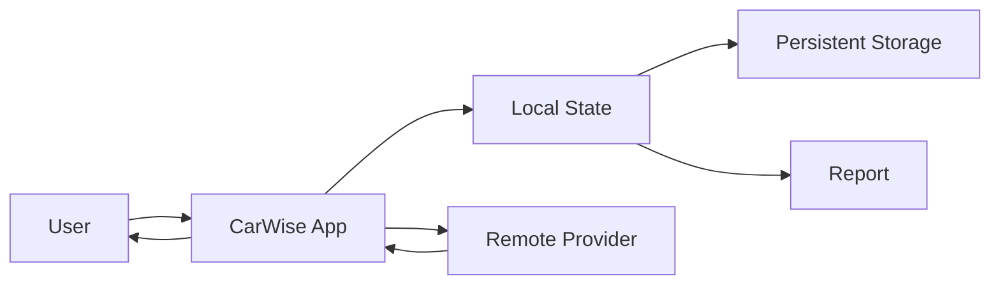
```mermaid
flowchart LR
    User["User"]
    App["CarWise App"]
    Local["Local State"]
    Storage["Persistent Storage"]
    Remote["Remote Provider"]
    Report["Report"]

    User --> App
    App --> Local
    Local --> Storage

    App --> Remote
    Remote --> App

    Local --> Report
    App --> User
```

---

# 4. Current Repository Baseline

The current repository is a mature prototype rather than a greenfield application.

The repository currently contains:

```text
App.js
app.config.ts
package.json
index.js
eas.json
babel.config.js
tsconfig.json
jest.config.js
eslint.config.mjs
assets/
components/
src/
dist/
tests/
```

The repository also includes multiple technical planning and redesign documents.

Examples include:

```text
APP_JS_INTEGRATION_V3.md
APP_STORE_FRONTEND_READINESS_V3.md
CARWISE_CURSOR_MIGRATION_CHECKLIST.md
CARWISE_FRONTEND_V5_AI_CODE.txt
CARWISE_REDESIGN_INTEGRATION_MAP.md
CODE_INDEX_V5.txt
INTEGRATION_NOTES_V3.md
MIGRATION_MAP_V3.md
README_V4_MOCKS.md
README_V5_AI_MOCK.md
V5_CHANGELOG.md
design.md
todo.md
```

The repository has also accumulated numerous visual and AI demonstration layers.

---

## 4.1 Current Runtime Baseline

The current package manifest declares:

| Technology          | Repository Version |
| ------------------- | -----------------: |
| Expo                |         `~50.0.14` |
| React Native        |           `0.73.6` |
| React               |           `18.2.0` |
| TypeScript          |           `^5.4.3` |
| Jest                |          `^29.7.0` |
| Jest Expo           |          `~50.0.4` |
| React Navigation    |                6.x |
| AsyncStorage        |           `1.21.0` |
| NetInfo             |           `11.1.0` |
| Sentry React Native |          `^5.22.0` |
| Zustand             |           `^4.5.2` |
| Axios               |           `^1.6.8` |
| SQLite              |          `~13.2.2` |
| Secure Store        |          `~12.8.1` |
| Camera              |          `~14.1.3` |
| Image Picker        |          `~14.7.1` |
| Image Manipulator   |          `~11.8.0` |
| Print               |          `^57.0.2` |
| Sharing             |         `^57.0.21` |

The repository also exposes scripts for development, testing, type-checking, linting, iOS building, and iOS submission.

---

## 4.2 Important Compatibility Note

Because the repository contains Expo-SDK-era dependencies mixed with semver ranges from different package generations, dependency upgrades should be handled as coordinated Expo upgrades.

Avoid independently changing:

```text
expo
expo-camera
expo-file-system
expo-image-picker
expo-print
expo-sharing
react-native
```

without validating the complete native dependency graph.

Recommended validation:

```bash
npx expo install --check
```

followed by application-level tests and a native development build.

---

# 5. Technology Stack

## 5.1 Frontend

```text
React Native
Expo
React Navigation
React Native Gesture Handler
React Native Reanimated
React Native SVG
Shopify FlashList
```

---

## 5.2 State

The current entry point is heavily hook-oriented and maintains authoritative application state through React state and utility/service functions.

Zustand is also present in the dependency graph.

The architecture should therefore distinguish:

```text
dependency availability
```

from:

```text
authoritative runtime state
```

The current integration documentation identifies `App.js` as the host boundary.

---

## 5.3 Persistence

The current application uses AsyncStorage for important application state such as:

```text
active inspection
pending inspection
settings
onboarding state
saved inspections
recovery state
```

The current repository also declares `expo-sqlite`, giving the project a path toward a stronger structured local database architecture.

---

## 5.4 Media

Current native media dependencies include:

```text
expo-camera
expo-image-picker
expo-image-manipulator
expo-file-system
expo-document-picker
expo-print
expo-sharing
```

This supports a field-oriented workflow in which media can be captured, transformed, stored, attached to evidence, rendered into reports, and shared.

---

## 5.5 Security

The repository includes:

```text
expo-secure-store
expo-local-authentication
```

for secure storage and biometric capability boundaries.

---

## 5.6 Observability

The dependency graph includes:

```text
@sentry/react-native
```

for production error monitoring.

---

# 6. Runtime Architecture

The mobile application should be viewed as several cooperating runtime layers.

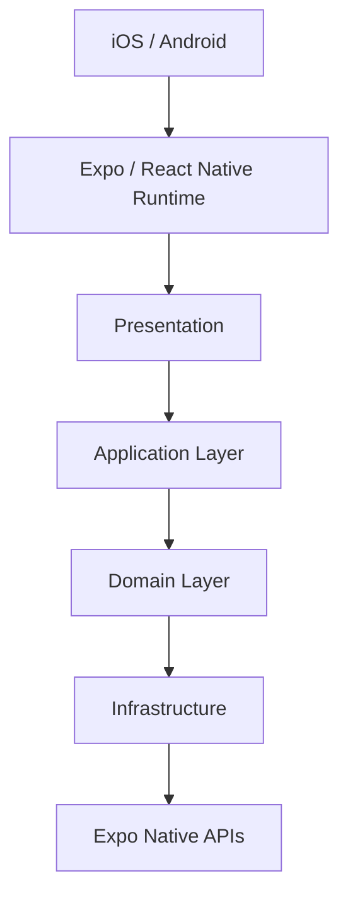
```mermaid
flowchart TB
    OS["iOS / Android"]
    Runtime["Expo / React Native Runtime"]
    UI["Presentation"]
    AppLayer["Application Layer"]
    Domain["Domain Layer"]
    Infra["Infrastructure"]
    Native["Expo Native APIs"]

    OS --> Runtime
    Runtime --> UI
    UI --> AppLayer
    AppLayer --> Domain
    Domain --> Infra
    Infra --> Native
```

---

## 6.1 Startup

Application startup should follow this general lifecycle:

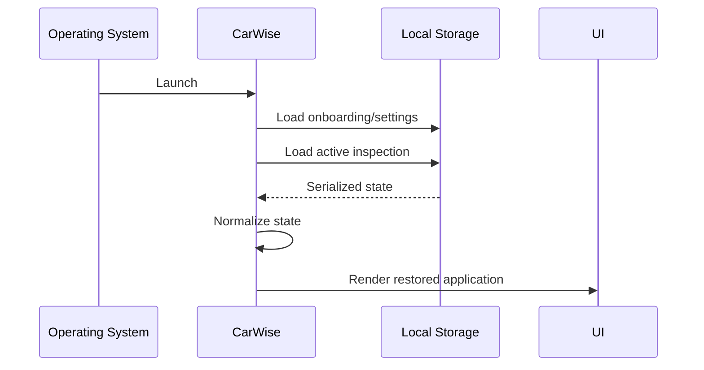
```mermaid
sequenceDiagram
    participant OS as Operating System
    participant APP as CarWise
    participant STORE as Local Storage
    participant UI as UI

    OS->>APP: Launch
    APP->>STORE: Load onboarding/settings
    APP->>STORE: Load active inspection
    STORE-->>APP: Serialized state
    APP->>APP: Normalize state
    APP->>UI: Render restored application
```

The repository's current `App.js` explicitly restores local inspection state and also attempts recovery of pending local saves and pending camera results.

---

## 6.2 Mount Safety

The current code uses mounted-state guards around asynchronous flows.

The pattern is:

```js
let mounted = true;

asyncOperation()
  .then(...)
  .catch(...)
  .finally(...)

return () => {
  mounted = false;
};
```

This protects against asynchronous callbacks attempting state updates after the screen or application component has been unmounted.

---

## 6.3 Action Generation Safety

The current application also tracks persistence/action generations.

Conceptually:

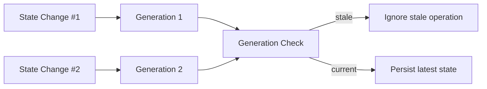
```mermaid
flowchart LR
    Change1["State Change #1"] --> Gen1["Generation 1"]
    Change2["State Change #2"] --> Gen2["Generation 2"]
    Gen1 --> Check["Generation Check"]
    Gen2 --> Check
    Check -->|stale| Drop["Ignore stale operation"]
    Check -->|current| Save["Persist latest state"]
```

This prevents stale delayed callbacks from overwriting newer state.

---

# 7. Application Composition

`App.js` currently acts as the main composition root.

Its responsibilities include:

```text
state creation
state restoration
navigation selection
inspection actions
AI actions
media actions
report actions
backup actions
recovery actions
redesign bridge
```

The repository has progressively introduced service utilities to reduce complexity.

Examples include:

```text
inspectionUtils
vinService
aiUtils
retryQueue
reportUtils
historyUtils
uiUtils
marketUtils
```

The current app imports these utilities directly.

---

## 7.1 Composition Root

A useful mental model is:

```text
App.js
│
├── Application State
│
├── Service Adapters
│
├── Navigation State
│
├── Persistence
│
├── Recovery
│
└── Presentation Shell
```

The next architectural evolution should move orchestration out of `App.js`.

---

## 7.2 Future Application Controller

A future structure could become:

```text
App.js
   ↓
CarWiseApplication
   ├── InspectionController
   ├── MediaController
   ├── AIController
   ├── ReportController
   ├── BackupController
   └── RecoveryController
```

This would reduce component-level coupling without requiring an immediate rewrite.

---

# 8. Domain Model

CarWise is fundamentally an inspection-domain application.

A canonical domain model can be represented as:

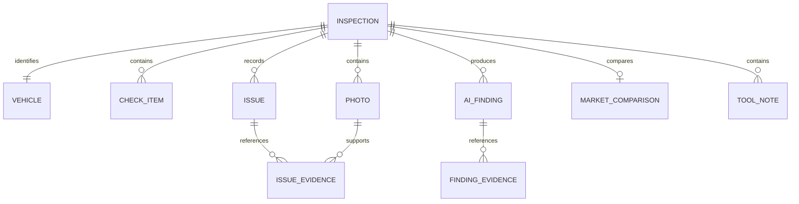
```mermaid
erDiagram
    INSPECTION ||--|| VEHICLE : identifies
    INSPECTION ||--o{ CHECK_ITEM : contains
    INSPECTION ||--o{ ISSUE : records
    INSPECTION ||--o{ PHOTO : contains
    INSPECTION ||--o{ AI_FINDING : produces
    INSPECTION ||--o| MARKET_COMPARISON : compares
    INSPECTION ||--o{ TOOL_NOTE : contains

    ISSUE ||--o{ ISSUE_EVIDENCE : references
    AI_FINDING ||--o{ FINDING_EVIDENCE : references
    PHOTO ||--o{ ISSUE_EVIDENCE : supports
```

---

## 8.1 Inspection

An inspection represents one vehicle evaluation event.

Conceptually:

```ts
interface Inspection {
  id: string;
  vehicle: Vehicle;
  issues: Issue[];
  checklist: Checklist;
  photos: PhotoEvidence[];
  aiResult?: AIResult;
  marketComparison?: MarketComparison;
  toolNotes: ToolNote[];
  createdAt: string;
  updatedAt: string;
}
```

---

## 8.2 Vehicle

```ts
interface Vehicle {
  year: string;
  make: string;
  model: string;
  mileage?: string;
  asking?: string;
  vin?: string;
}
```

The current application performs validation before allowing an inspection to progress.

The current flow requires:

```text
four-digit year
make
model
```

and requires an asking price before saving the inspection snapshot.

---

## 8.3 Issue

Issues are the primary structured representation of observed problems.

An issue can contain:

```text
id
name
severity
cost
note
source
evidence
```

The application also supports custom findings and merging of AI-derived findings into the issue state.

---

## 8.4 Checklist

The checklist provides the structured inspection workflow.

Conceptually:

```text
Exterior
Interior
Mechanical
Wheels / Tires
Test Drive
```

The current UI tracks completion and exposes progress.

---

## 8.5 Evidence

Evidence links physical observations to digital records.

Evidence may be:

```text
photo
document
note
AI reference
future audio/video artifact
```

---

# 9. Inspection Workflow

The primary workflow is:

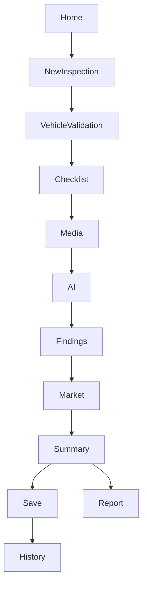
```mermaid
flowchart TD
    Home --> NewInspection
    NewInspection --> VehicleValidation
    VehicleValidation --> Checklist
    Checklist --> Media
    Media --> AI
    AI --> Findings
    Findings --> Market
    Market --> Summary
    Summary --> Save
    Save --> History
    Summary --> Report
```

---

## 9.1 Starting an Inspection

The current application provides an explicit `startInspection` action.

Starting an inspection should reset transient inspection state without accidentally deleting unrelated persisted history.

Conceptual behavior:

```text
startInspection()
    ↓
new inspection state
    ↓
clear transient AI state
    ↓
clear temporary media selection
    ↓
open inspection flow
```

---

## 9.2 Resuming

Resume semantics are different from starting.

Starting:

```text
fresh state
```

Resuming:

```text
existing state
```

A production implementation must never implement resume by calling a reset operation.

---

## 9.3 Validation Gate

Before entering the checklist, the application validates:

```text
year
make
model
```

Before saving:

```text
year
make
model
asking price
```

This makes the saved inspection suitable for history and comparison.

---

## 9.4 Checklist Mutation

Each checklist mutation should:

```text
update state
→ schedule persistence
→ update progress
→ preserve evidence
```

It should not require a network call.

---

# 10. Vehicle Identity and VIN

The VIN flow is a separate tool boundary.

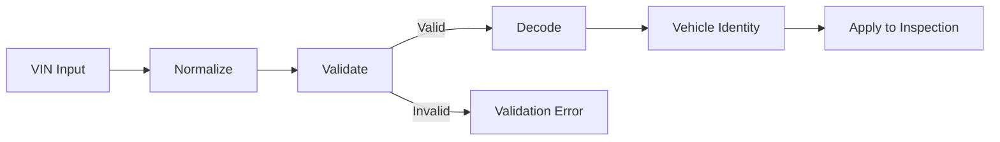
```mermaid
flowchart LR
    Input["VIN Input"] --> Normalize["Normalize"]
    Normalize --> Validate["Validate"]
    Validate -->|Valid| Decode["Decode"]
    Validate -->|Invalid| Error["Validation Error"]
    Decode --> Vehicle["Vehicle Identity"]
    Vehicle --> Inspection["Apply to Inspection"]
```

---

## 10.1 VIN Normalization

Recommended preprocessing:

```text
trim whitespace
uppercase
remove accidental separators
validate length
validate character set
```

---

## 10.2 VIN Provider Boundary

The UI should not directly consume raw provider responses.

Instead:

```ts
interface VinProvider {
  decode(vin: string): Promise<VehicleIdentity>;
}
```

The provider adapter maps vendor fields into the CarWise model.

---

## 10.3 Applying VIN Data

The current code imports:

```text
applyDecodedVehicle
```

from `vinService`.

This is an important boundary because decoding and applying a decoded vehicle are separate operations.

```text
VIN decode
    ↓
decoded vehicle
    ↓
validation / normalization
    ↓
applyDecodedVehicle()
    ↓
inspection state
```

---

# 11. Evidence and Media Architecture

Media is one of the most important technical areas because images are often much larger than ordinary state objects.

The desired architecture is:

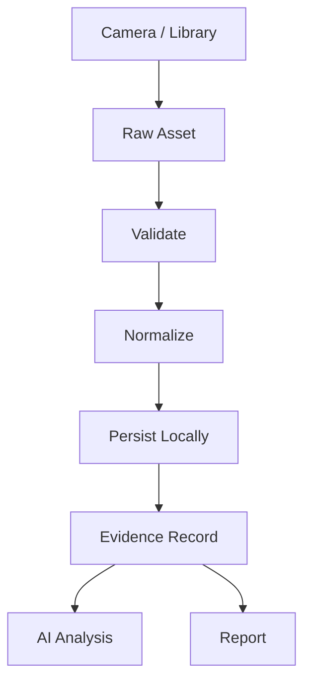
```mermaid
flowchart TD
    Camera["Camera / Library"] --> Asset["Raw Asset"]
    Asset --> Validate["Validate"]
    Validate --> Normalize["Normalize"]
    Normalize --> Persist["Persist Locally"]
    Persist --> Evidence["Evidence Record"]
    Evidence --> AI["AI Analysis"]
    Evidence --> Report["Report"]
```

---

## 11.1 Current Media Capabilities

The application integrates with:

```text
ImagePicker
DocumentPicker
ImageManipulator
FileSystem
Camera
```

The current code also supports replacing missing evidence assets.

---

## 11.2 Photo Metadata

A robust photo model should preserve:

```ts
interface PhotoEvidence {
  id: string;
  uri: string;
  width?: number;
  height?: number;
  mimeType?: string;
  fileName?: string;
  createdAt?: string;
  reviewState?: string;
}
```

---

## 11.3 Photo Review

The current application contains photo evidence review behavior.

A photo can be:

```text
unreviewed
reviewed
confirmed
```

The workflow can distinguish:

```text
user reviewed photo
```

from:

```text
user created issue from photo
```

That distinction is important.

---

## 11.4 Missing Asset Recovery

If a saved inspection references a missing media asset, the application should not crash.

Instead:

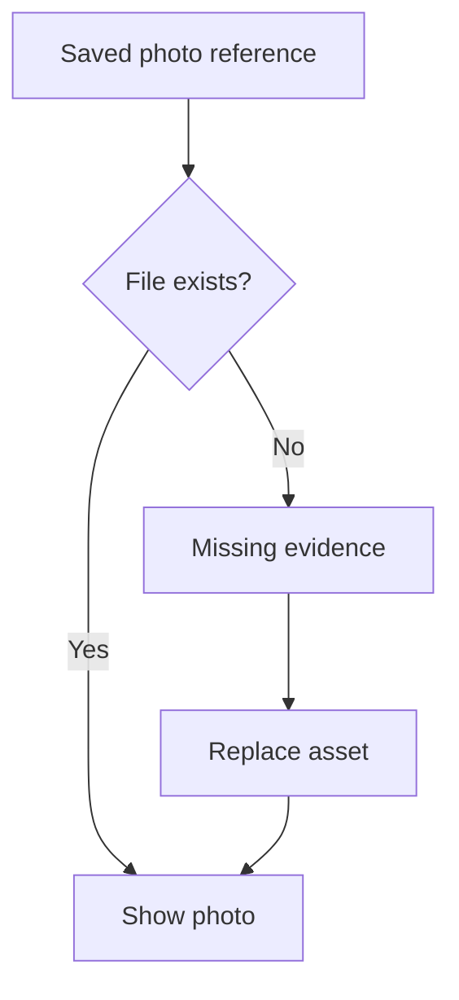
```mermaid
flowchart TD
    Reference["Saved photo reference"] --> Exists{"File exists?"}
    Exists -->|Yes| Viewer["Show photo"]
    Exists -->|No| Missing["Missing evidence"]
    Missing --> Replace["Replace asset"]
    Replace --> Viewer
```

The current repository includes a `replacePhotoAsset` pathway and UI guidance for resolving missing photo evidence.

---

## 11.5 Image Optimization

Production AI pipelines should avoid unnecessary base64 duplication.

Prefer:

```text
URI
 ↓
controlled read
 ↓
normalized binary
 ↓
provider upload
```

instead of:

```text
URI
 ↓
base64
 ↓
JSON string
 ↓
multiple in-memory copies
```

This reduces memory pressure on mobile devices.

---

# 12. AI Analysis Architecture

The current repository contains an explicit `aiUtils` service boundary.

The AI layer includes utilities for:

```text
buildAiAnalysis
buildOfflineFallbackAnalysis
AI confidence labels
AI finding explanations
AI readiness
AI evidence actions
photo evidence review
finding drafts
finding merge
AI history reset
analysis start state
AI review state
```

This demonstrates an important architecture:

> AI is modeled as a workflow, not simply as a single API call.

---

## 12.1 AI Pipeline

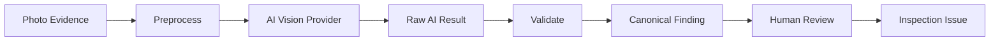
```mermaid
flowchart LR
    Evidence["Photo Evidence"] --> Preprocess["Preprocess"]
    Preprocess --> Provider["AI Vision Provider"]
    Provider --> Raw["Raw AI Result"]
    Raw --> Validate["Validate"]
    Validate --> Normalize["Canonical Finding"]
    Normalize --> Review["Human Review"]
    Review --> Issue["Inspection Issue"]
```

---

## 12.2 Provider Abstraction

Recommended interface:

```ts
interface VehicleVisionProvider {
  analyze(input: {
    vehicle: Vehicle;
    photo: PhotoEvidence;
    context?: string;
  }): Promise<AIAnalysisResult>;
}
```

The UI should never need to know whether the result was produced by:

```text
provider A
provider B
local model
mock implementation
```

---

## 12.3 AI Result Model

Recommended structure:

```ts
interface AIAnalysisResult {
  id: string;
  generatedAt: string;
  findings: AIFinding[];
  source: "live" | "offline" | "mock";
  provider?: string;
}
```

---

## 12.4 AI Finding

```ts
interface AIFinding {
  id: string;
  label: string;
  category: string;
  severity: "minor" | "moderate" | "critical";
  confidence: number;
  explanation: string;
  evidenceIds: string[];
  reviewState: "pending" | "accepted" | "dismissed";
}
```

---

## 12.5 Confidence Semantics

Confidence should never be represented as certainty.

For example:

```text
AI confidence: 0.91
```

means approximately:

```text
the model strongly prefers this interpretation
```

not:

```text
the vehicle definitely has this fault
```

---

## 12.6 Human Review

A critical design principle is:

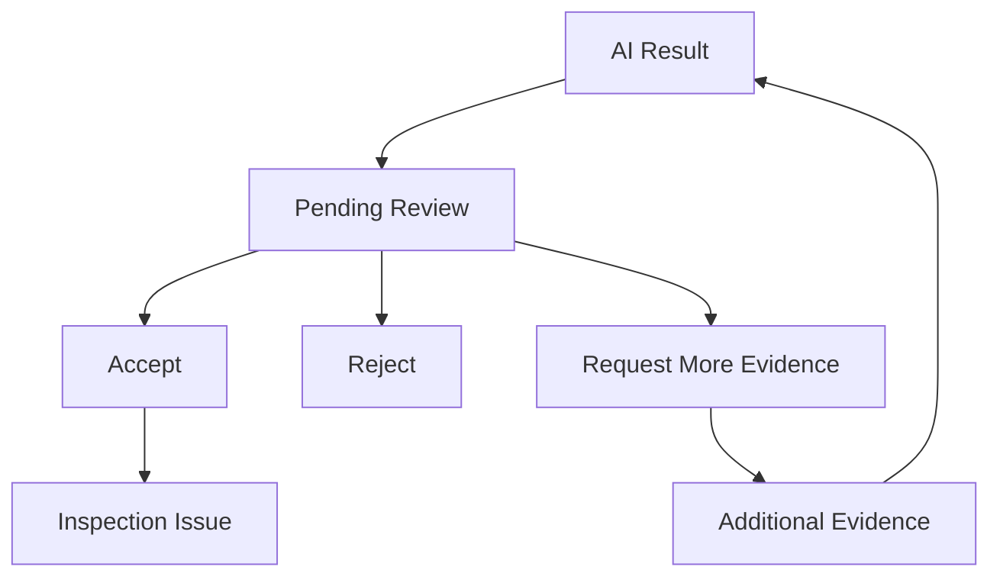
```mermaid
flowchart TD
    AIResult["AI Result"] --> Pending["Pending Review"]
    Pending --> Accept["Accept"]
    Pending --> Reject["Reject"]
    Pending --> More["Request More Evidence"]

    More --> Evidence["Additional Evidence"]
    Evidence --> AIResult

    Accept --> Issue["Inspection Issue"]
```

This preserves human control over high-impact findings.

---

## 12.7 Offline Fallback

The repository contains a `buildOfflineFallbackAnalysis` utility.

That means the product can preserve an analysis-oriented workflow even when a live AI provider is not available.

However, an offline fallback must remain visibly distinguishable from live inference.

Good:

```text
Offline analysis
Example guidance only
```

Bad:

```text
AI detected issue
```

when the result actually came from a fixture.

---

# 13. Market Comparison Engine

Market comparison is a separate domain from inspection analysis.

Its inputs may include:

```text
year
make
model
trim
mileage
location
asking price
condition
```

---

## 13.1 Market Data Pipeline

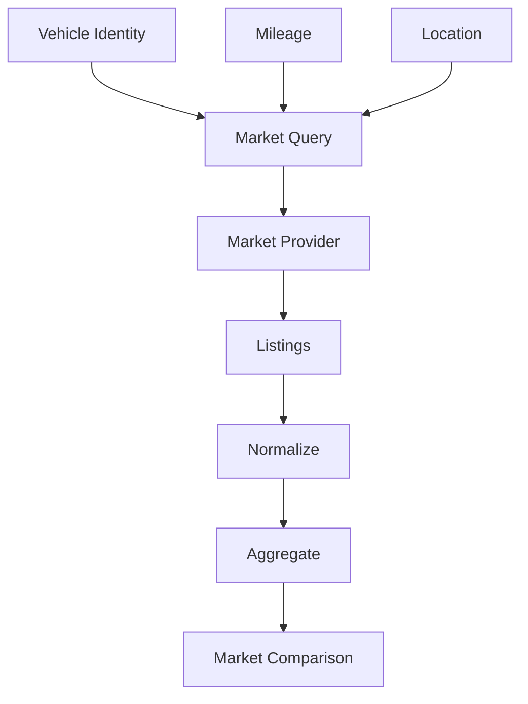
```mermaid
flowchart TD
    Vehicle["Vehicle Identity"] --> Query["Market Query"]
    Mileage["Mileage"] --> Query
    Location["Location"] --> Query
    Query --> Provider["Market Provider"]
    Provider --> Listings["Listings"]
    Listings --> Normalize["Normalize"]
    Normalize --> Aggregate["Aggregate"]
    Aggregate --> Comparison["Market Comparison"]
```

---

## 13.2 Canonical Market Model

```ts
interface MarketComparison {
  low?: number;
  fairPrice?: number;
  marketValue?: number;
  high?: number;
  sampleSize?: number;
  currency?: string;
  source?: string;
  retrievedAt?: string;
}
```

The current application explicitly calls:

```text
normalizeMarketComparison
```

when market data changes.

---

## 13.3 Normalization

Provider responses may vary:

```text
price
askingPrice
listPrice
salePrice
```

The normalization layer should map them into one canonical model.

---

## 13.4 Market Delta

A basic descriptive calculation is:

```text
priceDelta = askingPrice - marketReference
```

and:

```text
priceDeltaPercent =
    priceDelta / marketReference
```

These calculations describe observed differences.

They should not silently become an automatic purchase recommendation.

---

## 13.5 Market Data Freshness

A production market provider should track:

```text
source
retrieval time
sample size
location
query parameters
```

Otherwise the user cannot understand how recent or representative the comparison is.

---

# 14. Issue and Repair Modeling

Issues combine observations and financial context.

The current application calculates inspection repair totals and exposes inspection risk and comparison utilities through `historyUtils`.

---

## 14.1 Issue Lifecycle

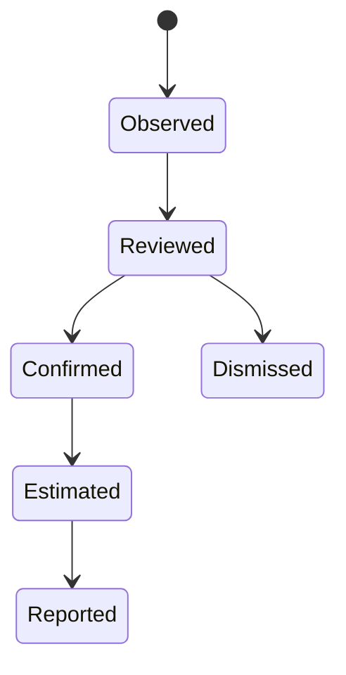
```mermaid
stateDiagram-v2
    [*] --> Observed
    Observed --> Reviewed
    Reviewed --> Confirmed
    Reviewed --> Dismissed
    Confirmed --> Estimated
    Estimated --> Reported
```

---

## 14.2 Repair Cost Model

A robust model should eventually distinguish:

```text
estimated low
estimated high
source
currency
confidence
labor
parts
```

Example:

```ts
interface RepairEstimate {
  low: number;
  high: number;
  currency: string;
  source: "user" | "ai" | "provider";
  confidence?: number;
}
```

---

## 14.3 Deterministic Calculations

Financial arithmetic should remain deterministic.

For example:

```text
repairLowTotal =
    sum(issue.repair.low)

repairHighTotal =
    sum(issue.repair.high)
```

AI can help interpret evidence.

It should not be responsible for arithmetic that the application can calculate directly.

---

## 14.4 Priority Ordering

Priority can be modeled as:

```text
critical
high
medium
low
informational
```

The UI may present priority through:

```text
label
icon
severity
cost
evidence
```

rather than relying exclusively on color.

---

# 15. Local Persistence

Local persistence is one of the most mature reliability areas of the repository.

The current `App.js` stores an inspection snapshot containing information including:

```text
vehicle
issues
checklist
photos
tool notes
market comparison
saved inspections
AI history
recovery log
last local action
```

The current implementation writes to AsyncStorage and also uses a pending inspection key for recovery.

---

## 15.1 Current Persistence Architecture

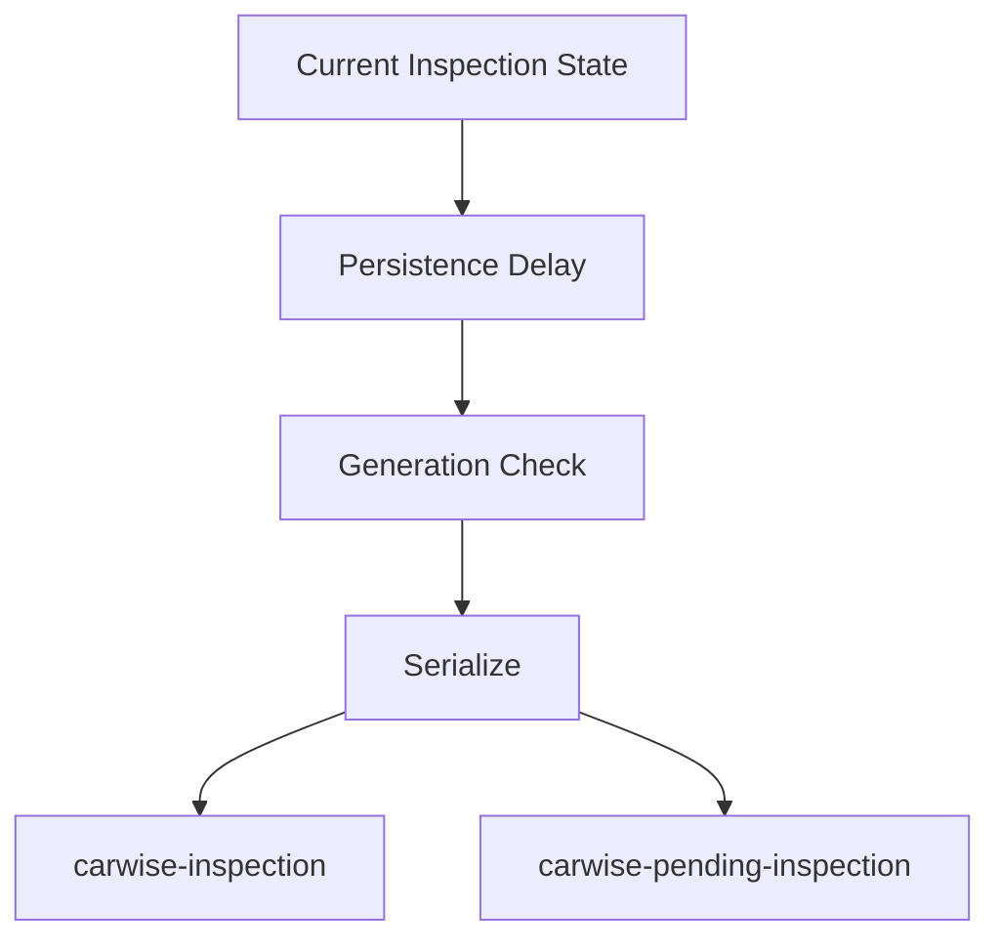
```mermaid
flowchart TD
    State["Current Inspection State"] --> Debounce["Persistence Delay"]
    Debounce --> Generation["Generation Check"]
    Generation --> Serialize["Serialize"]
    Serialize --> Primary["carwise-inspection"]
    Serialize --> Pending["carwise-pending-inspection"]
```

The primary record represents the normal durable state.

The pending record provides an additional recovery mechanism when the normal save operation fails.

---

## 15.2 Persistence Scheduling

The current application uses a delayed save.

Conceptually:

```text
state changes
     ↓
cancel previous timer
     ↓
schedule save
     ↓
check generation
     ↓
serialize
     ↓
persist
```

This prevents a high-frequency stream of UI changes from producing a storage write for every keystroke.

---

## 15.3 Persistence Generation

The current code maintains a persistence generation counter.

Conceptually:

```ts
const generation = nextGeneration();

schedule(() => {
  if (!isCurrentGeneration(generation)) {
    return;
  }

  persist();
});
```

This prevents stale work from committing after newer state exists.

---

## 15.4 Compact Local Copy

The application intentionally limits persisted photo/history payloads.

The current implementation:

* keeps a bounded number of recent photos;
* keeps bounded AI history;
* keeps bounded recovery history;
* warns when the serialized payload becomes large.

This is an important mobile-storage optimization.

---

# 16. Retry Queue and Recovery

The current repository contains an explicit:

```text
retryQueue
```

module.

It exports operations including:

```text
enqueueRetry
flushRetryQueue
getRetryDiagnostics
getRetryQueueSize
```

---

## 16.1 Retry Architecture

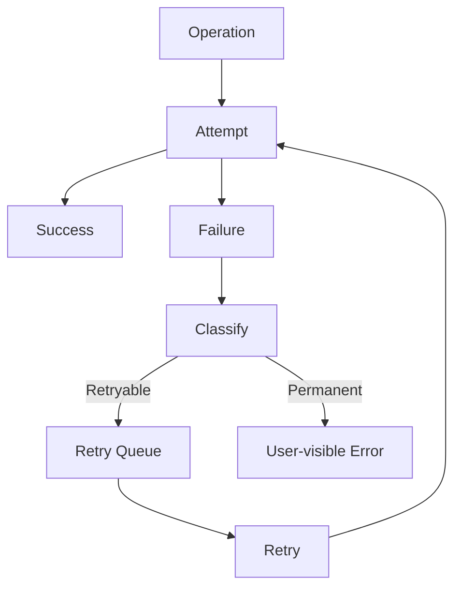
```mermaid
flowchart TD
    Operation["Operation"] --> Attempt["Attempt"]
    Attempt --> Success["Success"]
    Attempt --> Failure["Failure"]
    Failure --> Classify["Classify"]
    Classify -->|Retryable| Queue["Retry Queue"]
    Classify -->|Permanent| Error["User-visible Error"]
    Queue --> Retry["Retry"]
    Retry --> Attempt
```

---

## 16.2 Retryable Errors

Usually retryable:

```text
network timeout
temporary connection failure
temporary service failure
```

Potentially retryable:

```text
rate limit
server unavailable
```

Usually not retryable:

```text
invalid input
permission denied
unsupported request
malformed payload
```

---

## 16.3 Recovery UX

A retry system should not operate invisibly.

Good UI:

```text
Your inspection is saved locally.

One operation still needs attention.

[Retry]
```

rather than:

```text
console error
```

---

## 16.4 Recovery Log

The current application keeps a recovery log with entries describing operational events.

This enables:

```text
save failed
restore succeeded
AI failed
retry succeeded
report failed
```

to become visible operational state.

---

## 16.5 Diagnostic Export

The current application also has a diagnostic export path specifically designed to omit inspection details.

This allows support information to be shared without automatically exporting the full vehicle record.

That is a strong privacy architecture pattern.

---

# 17. Backup and Restore

The backup flow is conceptually:

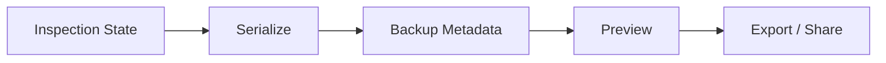
```mermaid
flowchart LR
    Inspection["Inspection State"] --> Serialize["Serialize"]
    Serialize --> Metadata["Backup Metadata"]
    Metadata --> Preview["Preview"]
    Preview --> Export["Export / Share"]
```

---

## 17.1 Backup Contents

The current application serializes core inspection state including:

```text
vehicle
issues
checklist
photos
tool notes
market comparison
saved inspections
AI history
```

---

## 17.2 Versioned Backups

A production backup should contain:

```json
{
  "schemaVersion": 1,
  "appVersion": "1.0.0",
  "exportedAt": "2026-09-26T00:00:00Z",
  "inspection": {}
}
```

Schema versioning allows future migrations.

---

## 17.3 Restore Safety

Never directly trust imported backup JSON.

Recommended pipeline:

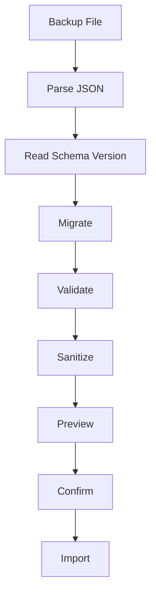
```mermaid
flowchart TD
    File["Backup File"] --> Parse["Parse JSON"]
    Parse --> Version["Read Schema Version"]
    Version --> Migrate["Migrate"]
    Migrate --> Validate["Validate"]
    Validate --> Sanitize["Sanitize"]
    Sanitize --> Preview["Preview"]
    Preview --> Confirm["Confirm"]
    Confirm --> Import["Import"]
```

---

## 17.4 Restore Sanitization

The current application already normalizes restored inspection state and can report when invalid or unsafe saved inspection entries are removed.

This pattern should be preserved.

---

# 18. Inspection History and Comparison

Saved inspections form a second-order product feature.

Instead of only looking at the current car, the user can maintain a local record of previously inspected vehicles.

The current application maintains:

```text
savedInspections
history query
history sort
selected saved inspection
comparison selection
comparison metrics
```

---

## 18.1 History Pipeline

```mermaid
flowchart LR
    Save["Save Inspection"] --> History["Saved Inspections"]
    History --> Filter["Filter"]
    Filter --> Sort["Sort"]
    Sort --> Detail["Inspection Detail"]
    Sort --> Compare["Comparison"]
```

---

## 18.2 Comparison

The current implementation limits active comparison to two saved inspections.

Conceptually:

```text
Inspection A
     +
Inspection B
     ↓
Comparison Model
     ↓
Metric Rows
```

Useful comparison dimensions include:

```text
asking price
market value
risk
issue count
repair estimate
inspection completion
```

---

## 18.3 Comparison Selection Safety

A deleted inspection should not remain in the comparison selection.

The current application includes:

```text
pruneComparisonSelection
```

which demonstrates the correct invariant:

```text
comparisonSelection ⊆ savedInspectionIds
```

---

# 19. Reporting and PDF Generation

The report pipeline converts structured inspection state into a shareable artifact.

```mermaid
flowchart TD
    State["Inspection State"] --> Snapshot["Report Snapshot"]
    Snapshot --> Sections["Report Sections"]
    Sections --> HTML["HTML"]
    HTML --> Print["Expo Print"]
    Print --> PDF["PDF"]
    PDF --> Share["Native Share"]
```

---

## 19.1 Current Report Utilities

The current application imports utilities for:

```text
buildInspectionReport
buildPhotoEvidenceHtml
formatCurrency
formatRepairPriorityHtml
getReportReadiness
getReportActionStartState
getReportActionStatus
getReportErrorGuidance
getReportProvenanceLabel
escapeHtml
```

This is a mature separation between report logic and screen rendering.

---

## 19.2 Report Sections

Recommended sections:

```text
Vehicle Summary
Inspection Overview
Checklist Progress
Issues
AI Findings
Photo Evidence
Repair Estimates
Market Comparison
Review / Provenance
Disclaimers
```

---

## 19.3 Report Snapshot

A report should use a stable snapshot.

```ts
const reportSnapshot = {
  vehicle,
  issues,
  checklist,
  photos,
  marketComparison,
  generatedAt: new Date().toISOString()
};
```

Then render the report from the snapshot.

This prevents report generation from changing if the live inspection state changes during rendering.

---

## 19.4 HTML Escaping

User-controlled strings must be escaped.

The repository already exposes:

```text
escapeHtml
```

This should be used for:

```text
notes
issue descriptions
vehicle fields
AI summaries
custom findings
```

---

## 19.5 Provenance

The report should preserve this relationship:

```mermaid
flowchart LR
    Evidence["Photo / Note"] --> Finding["Finding"]
    Finding --> Review["Human Review"]
    Review --> Recommendation["Report Context"]
    Recommendation --> Report["Final Report"]
```

The repository's App Store frontend readiness document specifically calls for maintaining provenance from evidence through findings and report sections.

---

# 20. Navigation and Redesign Architecture

The repository has evolved through several UI generations.

The current project includes:

```text
src/redesign
src/redesign-v3
src/redesign-v4
src/carwise-ai-v5
```

and corresponding preview/showcase routes.

---

## 20.1 Host Navigation

The current host architecture uses a `screen` state string.

Examples include:

```text
home
new
checklist
ai
summary
vin
market
history
test
photos
historyTab
savedDetail
profile
settings
notifications
```

The V3 integration documentation explicitly maps redesign routes onto these host routes.

---

## 20.2 Presentation Boundary

The redesign architecture intentionally keeps the visual layer separate.

```mermaid
flowchart TB
    HostState["App.js State"] --> Bridge["Redesign State / Action Bridge"]
    Bridge --> Shell["RedesignShell"]
    Shell --> Screens["Presentation Screens"]
    Screens --> Bridge
```

This is the correct direction.

Screens should not become the owners of business logic.

---

## 20.3 Redesign V3 Bridge

The current integration pattern includes:

```text
redesignState
redesignActions
RedesignShell
```

The V3 architecture maps existing state such as:

```text
vehicle
issues
checklist
photos
AI state
saved inspections
market comparison
settings
report readiness
retry queue
recovery log
```

into presentation components.

---

## 20.4 V3 Data Mapping

The current application maps values such as:

```text
vehicle.asking
```

into:

```text
askingPrice
```

and derives:

```text
marketValue
risk
hero image
photo URI collection
```

for the redesigned presentation layer.

This is presentation normalization.

It should not replace the canonical domain model.

---

## 20.5 Demo Routes

Current demo/showcase entry points include concepts such as:

```text
v3-preview
design-system-v4
ai-lab-v5
```

The repository explicitly documents V4 and V5 fixtures as visual QA/demo data.

They should remain isolated from production inspection state.

---

# 21. API and Provider Architecture

The original README described seven sponsor-oriented service boundaries:

```text
SerpApi
Perfect Corp
Xano
Nutrient DWS
Foxit eSign
Doctavian
name.com
```

For an engineering README, these should be described as **integration boundaries** rather than assuming every historical endpoint listed in the legacy README is a live production implementation.

---

## 21.1 Provider Adapter Pattern

```mermaid
flowchart TB
    Domain["CarWise Domain"] --> Port["Provider Interface"]

    Port --> Market["Market Adapter"]
    Port --> Vision["Vision Adapter"]
    Port --> VIN["VIN Adapter"]
    Port --> Documents["Document Adapter"]
    Port --> Signing["Signing Adapter"]
```

---

## 21.2 Why Adapters Matter

External providers change:

```text
authentication
endpoint paths
response formats
rate limits
pricing
service availability
model versions
```

If the vendor contract leaks into the UI, every provider change becomes a product-wide refactor.

Instead:

```text
Vendor API
   ↓
Adapter
   ↓
Canonical Model
   ↓
Domain
   ↓
UI
```

---

## 21.3 Market Provider Interface

```ts
interface MarketDataProvider {
  compare(query: MarketQuery): Promise<MarketComparison>;
}
```

---

## 21.4 Vision Provider Interface

```ts
interface VisionProvider {
  analyzePhoto(input: VisionInput): Promise<AIAnalysisResult>;
}
```

---

## 21.5 VIN Provider Interface

```ts
interface VINProvider {
  decode(vin: string): Promise<VehicleIdentity>;
}
```

---

## 21.6 Document Provider Interface

```ts
interface DocumentProvider {
  generate(input: DocumentRequest): Promise<DocumentResult>;
}
```

---

# 22. Security and Privacy

CarWise can contain sensitive data.

Potentially sensitive fields include:

```text
VIN
photos
documents
location
notes
seller information
inspection history
generated reports
authentication credentials
```

Security therefore needs to be designed into the architecture.

---

## 22.1 Threat Model

Potential threats include:

```text
lost device
malicious backup file
stolen API token
untrusted remote response
malicious HTML input
accidental diagnostic data leakage
third-party data exposure
```

---

## 22.2 Credential Storage

Use Secure Store for appropriate credentials:

```text
access tokens
refresh tokens
session identifiers
```

Do not store secrets directly in:

```text
App.js
Git
README
test fixtures
committed .env files
```

---

## 22.3 Client-Side Secret Limitation

A mobile application should not assume a compiled application can conceal a server-grade secret.

For sensitive vendor integrations:

```mermaid
flowchart LR
    Mobile["Mobile App"] --> Backend["Trusted Backend"]
    Backend --> Provider["External Provider"]
```

instead of:

```mermaid
flowchart LR
    Mobile["Mobile App"] --> Secret["Embedded Secret"]
    Secret --> Provider["External Provider"]
```

---

## 22.4 Backup Privacy

Backups can contain a complete inspection.

Therefore:

```text
backup export = sensitive action
```

The UI should explain what is being shared.

---

## 22.5 Diagnostic Privacy

Diagnostics should contain:

```text
app version
platform
error classes
retry counts
operational timestamps
```

but exclude:

```text
VIN
raw photos
private notes
seller identity
full inspection contents
```

The current code already follows this separation for diagnostic export.

---

## 22.6 AI Upload Privacy

Before production external AI processing:

```text
identify evidence
→ explain upload
→ upload
→ retain provider provenance
```

The application should clearly communicate that vehicle imagery may leave the device when a third-party provider is used.

---

# 23. Accessibility and UX Engineering

CarWise is used in physical environments where the user may be:

```text
standing
walking
holding a phone with one hand
outside in bright light
wearing gloves
working quickly
```

Therefore usability is not cosmetic.

---

## 23.1 Touch Targets

Interactive elements should use sufficiently large touch targets.

Prioritize:

```text
primary action
camera action
save
back
retry
confirm
```

---

## 23.2 Accessibility Labels

Important controls should expose semantic labels.

Example:

```tsx
<TouchableOpacity
  accessibilityRole="button"
  accessibilityLabel="Retry local save"
  onPress={retryLocalSave}
/>
```

The current application includes accessibility labels for important controls.

---

## 23.3 Reduced Motion

The current application reads accessibility motion settings and adjusts transitions.

```mermaid
flowchart LR
    OS["Reduce Motion"] --> Detect["AccessibilityInfo"]
    Detect --> Policy["Motion Policy"]
    Policy --> Animation["Animation"]
```

When reduced motion is enabled:

```text
reduce transition duration
remove unnecessary movement
avoid decorative motion
preserve functional feedback
```

---

## 23.4 Status Messaging

Asynchronous state should be communicated explicitly.

Examples:

```text
Saving inspection...
Inspection saved
Analysis running...
Analysis complete
Photo restored
Retry pending
Report ready
```

The current application uses live-region-friendly status presentation in important areas.

---

## 23.5 Color Independence

Do not use color alone for:

```text
warning
critical
success
```

Instead combine:

```text
color
icon
text label
supporting explanation
```

---

# 24. Performance Engineering

Mobile performance is particularly important because CarWise handles media.

---

## 24.1 Primary Performance Risks

```text
large photos
base64 conversion
large React state
history lists
PDF generation
multiple asynchronous requests
animation
frequent persistence
```

---

## 24.2 Memory

Avoid holding multiple copies of a large image.

Bad:

```text
image URI
+
base64 string
+
JSON payload
+
preview buffer
```

Better:

```text
local URI
+
small metadata object
```

and load the binary representation only when needed.

---

## 24.3 Rendering

For large history collections:

```text
FlashList
```

can reduce memory pressure and improve virtualization behavior.

The dependency is already present in the repository.

---

## 24.4 Expensive Derived State

Use memoization for expensive calculations:

```js
const comparison = useMemo(
  () => calculateComparison(savedInspections),
  [savedInspections]
);
```

The current application uses `useMemo` for several derived state calculations.

---

## 24.5 Persistence Debouncing

Persistence should not occur for every keystroke.

Preferred:

```text
input
input
input
input
      ↓
debounce
      ↓
single persistence operation
```

---

## 24.6 AI Concurrency

Do not automatically send an unbounded number of photos to an AI provider.

Use controlled concurrency:

```text
max concurrent = N
```

and support partial success.

Example:

```text
5 photos

Photo 1 → success
Photo 2 → success
Photo 3 → retry
Photo 4 → success
Photo 5 → invalid
```

The UI should preserve the three successful results.

---

# 25. Testing Strategy

Testing should cover both deterministic domain behavior and mobile integration.

---

## 25.1 Testing Pyramid

```mermaid
flowchart TB
    E2E["Device / E2E Tests"]
    Integration["Integration Tests"]
    Unit["Unit Tests"]

    E2E --> Integration
    Integration --> Unit
```

The majority of business logic should remain in fast unit tests.

---

## 25.2 Unit Test Areas

Recommended:

```text
VIN validation
VIN normalization
inspection normalization
issue merging
repair totals
market calculations
history filtering
history sorting
comparison selection
backup serialization
restore sanitization
retry classification
AI normalization
report HTML escaping
report readiness
```

---

## 25.3 Example

```ts
describe("inspection repair totals", () => {
  it("calculates deterministic totals", () => {
    const issues = [
      { cost: 400 },
      { cost: 900 },
    ];

    expect(getInspectionRepairTotal(issues)).toBe(1300);
  });
});
```

The exact helper should match the implementation in the repository.

---

## 25.4 Integration Tests

Integration tests should verify boundaries such as:

```text
App → local storage
App → retry queue
App → AI utility
App → history utility
App → report utility
App → media utility
```

---

## 25.5 Failure Injection

Production resilience requires failure testing.

Simulate:

```text
storage failure
network timeout
malformed provider response
permission denial
missing media
cancelled media picker
report generation failure
share unavailable
```

---

## 25.6 Backup Round-Trip

A particularly important invariant:

```text
inspection
    ↓
serialize
    ↓
parse
    ↓
normalize
    ↓
inspection'
```

should preserve the important semantic data.

---

## 25.7 Property Invariants

Useful invariants include:

```text
progress >= 0
progress <= 100

confidence >= 0
confidence <= 1

repair total >= 0

comparisonSelection.length <= 2

savedInspection.id is unique
```

---

# 26. Error Handling and Resilience

A production mobile app needs multiple error states.

---

## 26.1 Error Taxonomy

```text
VALIDATION_ERROR
PERMISSION_ERROR
MEDIA_ERROR
NETWORK_ERROR
TIMEOUT
RATE_LIMITED
PROVIDER_ERROR
PERSISTENCE_ERROR
SERIALIZATION_ERROR
REPORT_ERROR
AUTH_ERROR
UNKNOWN_ERROR
```

---

## 26.2 Error Normalization

A normalized error model:

```ts
interface AppError {
  code: string;
  message: string;
  retryable: boolean;
  userMessage: string;
  operation?: string;
}
```

---

## 26.3 Error Flow

```mermaid
flowchart TD
    Operation["Application Operation"] --> Try["Attempt"]
    Try -->|Success| State["Update State"]
    Try -->|Failure| Normalize["Normalize Error"]
    Normalize --> Retryable{"Retryable?"}
    Retryable -->|Yes| Queue["Queue Retry"]
    Retryable -->|No| User["Show Guidance"]
    Queue --> User
```

---

## 26.4 App-Level Error Boundary

The application should have a root error boundary for unexpected rendering failures.

The fallback should provide:

```text
problem statement
recovery action
information preservation
```

The error screen should never imply that the user's inspection is necessarily lost simply because a rendering component failed.

---

## 26.5 Partial Failure

Suppose report generation fails.

The correct state is:

```text
inspection = intact
report = failed
retry = available
```

not:

```text
inspection = failed
```

This distinction is essential.

---

# 27. Build and Release Engineering

The current package manifest exposes:

```bash
npm run start
npm run start:go
npm run ios
npm run android
npm run test
npm run lint
npm run typecheck
npm run build:ios
npm run submit:ios
```

---

## 27.1 Development

```bash
npm install
npm run start:go
```

Development-client workflow:

```bash
npm run start
```

iOS:

```bash
npm run ios
```

Android:

```bash
npm run android
```

---

## 27.2 Validation

Before release:

```bash
npm run typecheck
npm run lint
npm test
```

For coverage:

```bash
npm test -- --coverage
```

---

## 27.3 Production iOS

The current package scripts define:

```bash
npm run build:ios
```

which uses EAS production configuration.

Submission:

```bash
npm run submit:ios
```

---

## 27.4 Versioning

A production release should define:

```text
version
build number
git commit
Expo SDK
environment
feature configuration
```

---

## 27.5 Native Configuration

The current Expo configuration includes:

```text
CarWise application identity
portrait orientation
custom scheme
iOS bundle identifier
Android package
camera permission
other native permission configuration
```

Native permissions should always be reviewed alongside the actual features shipped.

---

# 28. Environment Configuration

A production application should distinguish:

```text
development
staging
production
```

---

## 28.1 Configuration Domains

Typical configuration values:

```text
API_BASE_URL
VIN_PROVIDER_URL
MARKET_PROVIDER_URL
VISION_PROVIDER_URL
BACKEND_URL
SENTRY_DSN
FEATURE_FLAGS
```

---

## 28.2 Environment Separation

```mermaid
flowchart LR
    Dev["Development"] --> DevServices["Development Providers"]
    Staging["Staging"] --> StageServices["Staging Providers"]
    Prod["Production"] --> ProdServices["Production Providers"]
```

Never point development mock/demo data at production customer databases.

---

## 28.3 `.env.example`

The repository already includes an `.env.example`.

An example configuration should document:

```text
variable name
required / optional
client-safe / server-only
example value
purpose
```

Never store real secrets in `.env.example`.

---

# 29. Repository Structure

A technical understanding of the current repository is:

```text
ai-used-car-checker/
│
├── App.js
│
├── DevNetworkHackathonApp.js
│
├── index.js
│
├── app.config.ts
├── eas.json
├── package.json
├── package-lock.json
├── tsconfig.json
├── babel.config.js
├── eslint.config.mjs
├── jest.config.js
│
├── assets/
│
├── components/
│
├── src/
│   ├── services/
│   ├── redesign/
│   ├── redesign-v3/
│   ├── redesign-v4/
│   └── carwise-ai-v5/
│
├── tests/
│
├── dist/
│
├── APP_JS_INTEGRATION_V3.md
├── APP_STORE_FRONTEND_READINESS_V3.md
├── CARWISE_REDESIGN_INTEGRATION_MAP.md
├── CODE_INDEX_V5.txt
├── README_V4_MOCKS.md
├── README_V5_AI_MOCK.md
├── V5_CHANGELOG.md
│
└── README.md
```

---

## 29.1 Service Layer

The current root application imports several service boundaries.

### `inspectionUtils`

Responsible for:

```text
new inspection creation
normalization
issue comparison
reset state
```

### `vinService`

Responsible for:

```text
decoded vehicle application
```

### `aiUtils`

Responsible for:

```text
AI analysis construction
confidence
review
finding merge
offline fallback
```

### `retryQueue`

Responsible for:

```text
enqueue
flush
diagnostics
queue size
```

### `reportUtils`

Responsible for:

```text
report generation
error handling
provenance
status
HTML escaping
persistence helpers
```

### `historyUtils`

Responsible for:

```text
history
saved inspections
comparison
risk
repair totals
report readiness
```

### `uiUtils`

Responsible for:

```text
photo normalization
photo replacement
media error guidance
navigation cleanup
evidence health
```

### `marketUtils`

Responsible for:

```text
market comparison normalization
```

---

# 30. Architecture Decision Records

## ADR-001 — Local-first inspection state

### Decision

Inspection state should be durable locally before requiring remote synchronization.

### Rationale

Field inspection environments are unpredictable.

### Consequences

The system must support:

```text
local serialization
restore
retry
recovery
data migration
```

---

## ADR-002 — AI adapter boundary

### Decision

AI providers should be wrapped behind provider-neutral interfaces.

### Rationale

AI providers and models change independently of the product domain.

### Consequence

A new provider should require changing the adapter rather than every screen.

---

## ADR-003 — Evidence-linked findings

### Decision

Findings should reference evidence IDs.

### Rationale

Users need to know what evidence produced a finding.

### Consequence

Deleting evidence requires dependent-state handling.

---

## ADR-004 — Recovery is user-visible

### Decision

Persistence and external-service failures that affect data should appear in product UI.

### Rationale

Users need confidence that work has not disappeared.

### Consequence

Save/retry state becomes part of the UX system.

---

## ADR-005 — Demo fixtures are isolated

### Decision

Visual QA data should never silently become authoritative inspection data.

### Rationale

Prototype fixtures are deterministic examples, not customer records.

### Consequence

Demo routes and data should remain explicitly labeled.

---

## ADR-006 — Presentation bridge

### Decision

Redesign screens receive canonicalized presentation state and callbacks through a bridge.

### Rationale

UI redesign should not force business-logic duplication.

### Consequence

`redesignState` and `redesignActions` remain integration boundaries.

---

# 31. Production Hardening Roadmap

The project has a clear path from prototype architecture to a production-grade system.

---

## Phase 1 — Extract application controllers

Move orchestration from `App.js` into:

```text
InspectionController
MediaController
AIController
PersistenceController
ReportController
RecoveryController
```

---

## Phase 2 — Runtime schemas

TypeScript types are compile-time structures.

They do not validate external JSON.

Introduce runtime validation for:

```text
Vehicle
Inspection
Issue
Photo
AIResult
MarketComparison
Backup
```

---

## Phase 3 — Formal database layer

Move large inspection data from broad AsyncStorage blobs toward structured SQLite tables.

Potential schema:

```mermaid
erDiagram
    INSPECTION {
        string id
        string created_at
        string updated_at
        string status
    }

    VEHICLE {
        string id
        string inspection_id
        string vin
        string year
        string make
        string model
    }

    ISSUE {
        string id
        string inspection_id
        string severity
        string source
        number cost_low
        number cost_high
    }

    PHOTO {
        string id
        string inspection_id
        string uri
        string mime_type
    }

    INSPECTION ||--|| VEHICLE : has
    INSPECTION ||--o{ ISSUE : contains
    INSPECTION ||--o{ PHOTO : contains
```

---

## Phase 4 — Remote Sync

A production sync envelope could use:

```json
{
  "operationId": "operation-id",
  "entity": "inspection",
  "entityId": "inspection-id",
  "version": 12,
  "updatedAt": "2026-09-26T17:00:00Z",
  "deleted": false,
  "payload": {}
}
```

---

## Phase 5 — Conflict Resolution

Instead of blindly overwriting records:

```mermaid
flowchart TD
    Local["Local Update"] --> Compare{"Remote Version Changed?"}

    Compare -->|No| Upload["Upload"]
    Compare -->|Yes| Merge["Conflict Resolver"]

    Merge --> Safe["Auto-Merge Safe Fields"]
    Merge --> UserReview["Human Review"]

    Safe --> Commit["Commit"]
    UserReview --> Commit
```

---

## Phase 6 — Media Sync

Media needs its own lifecycle:

```text
LOCAL
QUEUED
UPLOADING
UPLOADED
FAILED
DELETED
```

This allows a large photo to fail without making the entire inspection appear failed.

---

## Phase 7 — AI Provenance

Store:

```text
provider
model
prompt version
generatedAt
confidence
evidence IDs
review state
```

This makes AI results auditable and reproducible.

---

## Phase 8 — Observability

Measure:

```text
startup duration
local save failure rate
AI success rate
retry rate
report failure rate
media failure rate
offline queue depth
restore failure rate
```

Avoid collecting unnecessary personal content.

---

## Phase 9 — Security Review

Before handling real customer data:

```text
secret scan
dependency audit
permission audit
backup audit
HTML injection audit
remote-response validation
logging audit
privacy review
```

---

## Phase 10 — Release Certification

A release candidate should pass:

```text
fresh install
first-run onboarding
permission flow
VIN workflow
inspection workflow
photo workflow
AI workflow
offline workflow
restart recovery
history workflow
comparison
backup export
restore
PDF generation
share
settings
error recovery
```

---

# 32. Engineering Contribution Guide

## 32.1 Branch Naming

Recommended:

```text
feature/inspection-history
feature/ai-provider-adapter
fix/photo-restore
fix/persistence-race
refactor/report-service
```

---

## 32.2 Commit Structure

Prefer focused commits:

```text
feat: add market normalization
fix: prevent stale persistence callback
refactor: extract report builder
test: cover backup restore sanitization
docs: update architecture
```

---

## 32.3 Pull Requests

A technical pull request should document:

```text
Problem
Architecture
Files changed
State impact
Persistence impact
Offline behavior
Error handling
Testing
Accessibility
Security
Known limitations
```

---

## 32.4 Definition of Done

A feature is complete when:

```text
✓ happy path
✓ empty state
✓ loading state
✓ error state
✓ retry behavior
✓ persistence behavior
✓ offline behavior
✓ accessibility
✓ tests
✓ production configuration
✓ documentation
```

---

# 33. Troubleshooting

## Metro / Expo Issues

Reset the bundler cache:

```bash
npx expo start -c
```

---

## Dependency Mismatch

Run:

```bash
npx expo install --check
```

Then inspect mismatched Expo packages.

---

## TypeScript Errors

Run:

```bash
npm run typecheck
```

---

## Lint Errors

Run:

```bash
npm run lint
```

---

## Test Errors

Run:

```bash
npm test
```

For targeted debugging:

```bash
npx jest path/to/test
```

---

## Camera Problems

Check:

```text
camera permission
physical device availability
native build configuration
pending camera result handling
```

The application already includes pending media recovery behavior.

---

## Photo Missing After Restore

Check:

```text
stored URI
file existence
replacement flow
```

The current application supports replacement of missing photo assets.

---

## Persistence Failure

The application exposes retry and recovery concepts.

Inspect:

```text
save state
retry queue count
recovery log
pending inspection
```

---

## Report Failure

Check:

```text
report readiness
HTML generation
PDF generation
native sharing availability
```

Do not delete or reset the inspection simply because report generation fails.

---

# 34. Technical Glossary

### Inspection

A structured evaluation record representing one used vehicle.

### Evidence

A photo, document, note, or other artifact associated with an observation.

### AI Finding

An AI-generated interpretation associated with one or more evidence items.

### Human Review

A user action that accepts, dismisses, or requests additional evidence for a finding.

### Market Comparison

A normalized representation of external market-price context.

### Local-first

An architecture where essential user work remains available locally without requiring immediate server availability.

### Retry Queue

A durable or semi-durable list of operations awaiting another attempt.

### Provenance

The relationship between source evidence and derived information.

### Canonical Model

The application's internal representation independent of a vendor's response schema.

### Adapter

Infrastructure code translating between an external provider and a canonical interface.

### Persistence Generation

A version marker used to prevent stale asynchronous operations from writing older state over newer state.

### Recovery Log

Operational events describing save, restore, retry, and other recovery activity.

### Report Snapshot

An immutable or stable copy of the inspection state used for document generation.

---

# 35. Final Architecture Summary

CarWise can be reduced to one architectural sequence:

```mermaid
flowchart TB
    User["Human User"]
    Vehicle["Vehicle Identity"]
    Inspection["Inspection State"]
    Evidence["Evidence"]
    AI["AI Analysis"]
    Market["Market Context"]
    Review["Human Review"]
    Local["Local Persistence"]
    Recovery["Recovery"]
    Report["Report"]

    User --> Vehicle
    Vehicle --> Inspection
    User --> Evidence
    Evidence --> Inspection

    Inspection --> AI
    Inspection --> Market

    AI --> Review
    Market --> Review
    Review --> Inspection

    Inspection --> Local
    Local --> Recovery
    Inspection --> Report
```

The most important technical principle is the separation of:

```text
observation
```

from:

```text
interpretation
```

and:

```text
interpretation
```

from:

```text
final user decision
```

That creates a safer and more maintainable foundation for AI-powered vehicle inspection.

---

# Engineering Philosophy

The simplest possible version of CarWise could be:

```text
open camera
take photo
show AI result
```

The architecture in this repository is more ambitious.

It attempts to answer:

```text
What vehicle was inspected?
What did the user observe?
What evidence exists?
What did AI infer?
What did the user accept?
What market context was available?
What could the repairs cost?
Was the inspection saved?
Can it be recovered?
Can the report be reproduced?
Can the inspection be compared later?
```

Those questions require a system rather than a single screen.

The resulting architecture is therefore:

```text
                    ┌─────────────────────────────┐
                    │        PRESENTATION         │
                    │ React Native / Redesigns    │
                    └──────────────┬──────────────┘
                                   │
                    ┌──────────────▼──────────────┐
                    │     APPLICATION LAYER       │
                    │ workflows / actions / state │
                    └──────────────┬──────────────┘
                                   │
                    ┌──────────────▼──────────────┐
                    │       DOMAIN MODEL          │
                    │ inspection / issues / media │
                    └──────────────┬──────────────┘
                                   │
              ┌────────────────────┼────────────────────┐
              │                    │                    │
      ┌───────▼────────┐   ┌───────▼────────┐   ┌──────▼────────┐
      │ LOCAL STORAGE  │   │   AI / MARKET  │   │   REPORTING   │
      │ persistence    │   │    adapters    │   │ PDF / share   │
      └────────────────┘   └────────────────┘   └───────────────┘
```

The long-term goal should not be to make every feature depend on an external API.

The long-term goal should be to create a **durable inspection data platform** in which:

```text
local state
+
evidence
+
human observations
+
AI interpretation
+
market context
+
recovery
+
provenance
+
reporting
```

form one coherent system.

That is the architectural foundation on which additional capabilities can be built without repeatedly rewriting the application.

---

# Current Repository References

The repository contains additional implementation documentation that should remain the source of truth for detailed migration work:

```text
APP_JS_INTEGRATION_V3.md
APP_STORE_FRONTEND_READINESS_V3.md
CARWISE_REDESIGN_INTEGRATION_MAP.md
CODE_INDEX_V5.txt
README_V4_MOCKS.md
README_V5_AI_MOCK.md
V5_CHANGELOG.md
INTEGRATION_NOTES_V3.md
MIGRATION_MAP_V3.md
```

For implementation work, always verify the current code before assuming that an older architectural diagram, endpoint example, mock service, or sponsor integration still represents live production behavior.

---

# License

See the repository's `LICENSE` file for the definitive licensing terms.

---

## CarWise

**AI-assisted used-car inspection, designed around evidence, resilience, and structured decision support.**
